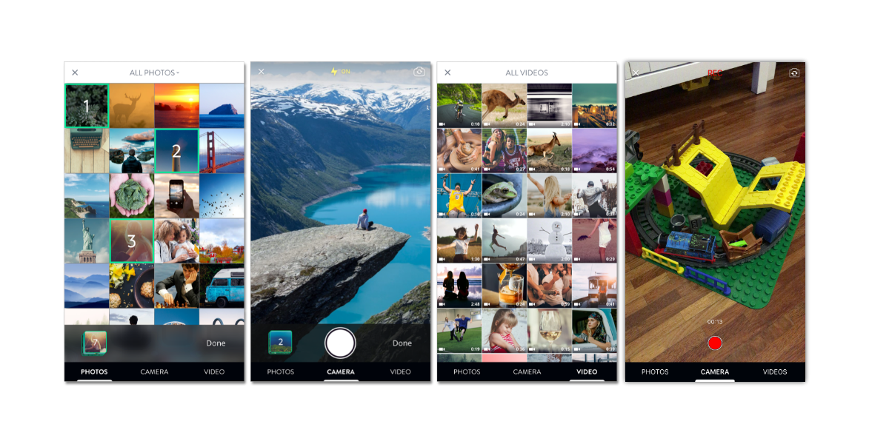

### Description

`AbraGallery` is a small library for images & videos picking. It provides video recording too.

### Usage

`GalleryController` is the main entry point, just instantiate and set the delegate:

```swift
let gallery = GalleryController()
gallery.delegate2 = self
present(gallery, animated: true, completion: nil)
```

### Delegate

The `GalleryControllerDelegate2` requires you to implement some delegate methods in order to interact with the `GalleryController`

```swift
public protocol GalleryControllerDelegate2: class {
  func galleryController(_ controller: GalleryController, requestLightbox images: [UIImage])
  func galleryControllerDidCancel(_ controller: GalleryController)
  func galleryController(_ controller: GalleryController, didSelectAssets assets: [PHAsset])
}
```

### Permission

`Gallery` handles permissions for you. It checks and askes for photo and camera usage permissions at first launch. As of iOS 10, we need to explicitly declare usage descriptions in plist files

```xml
<key>NSCameraUsageDescription</key>
<string>This app requires access to camera</string>
<key>NSPhotoLibraryUsageDescription</key>
<string>This app requires access to photo library</string>
```
You may disable permissions flow by the config `Gallery.Config.Permission.shouldCheckPermission = false`

### Configuration

There are lots of customization points in `Config` structs. For example

```swift
Config.Permission.image = UIImage(named: ImageList.Gallery.cameraIcon)
Config.Font.Text.bold = UIFont(name: FontList.OpenSans.bold, size: 14)!
Config.Camera.recordLocation = true
Config.Camera.recordMode = .video                  // to enable video recording.
Config.VideoRecording.maxBytesCount = 1024         // to set the maximum size of video.
Config.VideoRecording.maxLengthInSeconds = .video  // to set the max length of video.
Config.Selection.mode = [.photo, .camera, .video]  // to enable/disable Photo, Camera and Video tabs.
Config.SessionPreset.quality = AVCaptureSessionPresetHigh // to define the quality of recorded video.

... and many many more at Config file.
```

## Installation

**AbraGallery** is available through [CocoaPods](http://cocoapods.org). To install it, simply add the following line to your Podfile:

```ruby
pod 'AbraGallery'
```

**AbraGallery** can also be installed manually. Just download and drop `Sources` folders in your project.

## Author & Contact

OpenSooq, ramzi.q@opensooq.com, damian.k@opensooq.com

Abra Gallery is build at the top of [Gallery](https://github.com/blueimp/Gallery) project.

## Contributing

We would love you to contribute to **AbraGallery**, check the [CONTRIBUTING](https://github.com/hyperoslo/Gallery/blob/master/CONTRIBUTING.md) file for more info.

## License

**Gallery** is available under the MIT license. See the [LICENSE](https://github.com/hyperoslo/Gallery/blob/master/LICENSE.md) file for more info.
